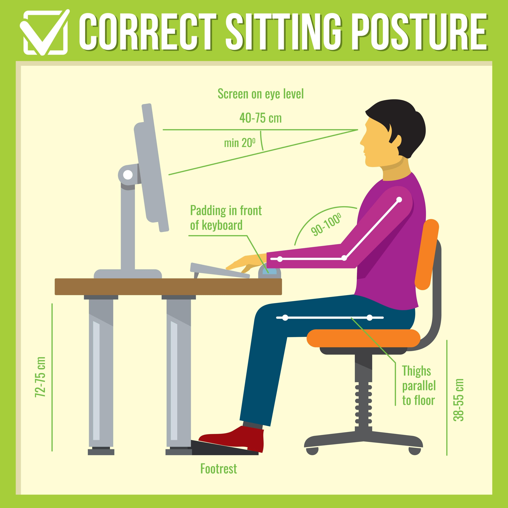

# 🛡️ Plan de Prevención de Riesgos Laborales (PRL)

## 1. Introducción
Este documento detalla los riesgos laborales asociados al desarrollo del proyecto **Ecommerce-PI** y las medidas preventivas adoptadas por el equipo de desarrollo. El objetivo es garantizar la seguridad y salud de los desarrolladores (Kevin Tolsa y Adam Aaloul) durante las fases de diseño, programación y despliegue, cumpliendo con la normativa vigente sobre trabajos con Pantallas de Visualización de Datos (PVD).

## 2. Identificación de Riesgos y Medidas Preventivas

A continuación se detallan los riesgos específicos del puesto de "Desarrollador Web" y las acciones para mitigarlos.

| Factor de Riesgo | Descripción y Consecuencias | Medidas Preventivas Adoptadas |
| :--- | :--- | :--- |
| **Fatiga Visual** | Cansancio ocular, sequedad, picor o visión borrosa debido a la atención continua a la pantalla y mala iluminación. | • **Regla 20-20-20:** Cada 20 min, mirar a 6 metros durante 20 seg. • Configurar el monitor con brillo/contraste adecuado. • Ubicar el puesto de trabajo perpendicular a las ventanas para evitar reflejos. |
| **Trastornos Musculoesqueléticos** | Dolores en zona cervical, dorsal y lumbar por posturas estáticas prolongadas (sedentarismo). | • Uso de silla regulable en altura y respaldo. • Mantener la espalda recta y apoyada en el respaldo. • Realizar estiramientos cada 2 horas de trabajo. |
| **Lesiones por Movimientos Repetitivos** | Síndrome del túnel carpiano o tendinitis por uso intensivo de teclado y ratón. | • Uso de reposamuñecas en el teclado. • Ratón ergonómico adecuado al tamaño de la mano. • Antebrazos apoyados sobre la mesa, formando un ángulo de 90º-100º con el brazo. |
| **Carga Mental (Estrés)** | Ansiedad, fatiga mental o bloqueo ("Burnout") por plazos de entrega ajustados o complejidad del código. | • Planificación realista mediante **GitHub Projects** (Kanban). • Definición clara de tareas y reparto equitativo. • Descansos activos lejos del ordenador. |
| **Riesgos Eléctricos** | Contacto eléctrico directo o indirecto por equipos en mal estado. | • Revisión visual del cableado del PC y monitores. • No sobrecargar regletas o enchufes. • Mantener la zona de trabajo libre de líquidos cerca de componentes electrónicos. |

## 3. Ergonomía del Puesto de Trabajo

Para cumplir con la higiene postural, el puesto de desarrollo debe seguir las siguientes pautas de configuración:

1.  **Monitor:** El borde superior de la pantalla debe estar a la altura de los ojos o ligeramente por debajo. Distancia recomendada: 40-75 cm.
2.  **Silla:** Debe permitir apoyar los pies planos en el suelo (o usar reposapiés) y mantener las rodillas en ángulo de 90º.
3.  **Mesa:** Superficie mate para evitar reflejos, con espacio suficiente para teclado, ratón y documentos.
4.  **Entorno:** Temperatura de confort (23ºC - 26ºC) y ventilación adecuada.

## 4. Normativa de Referencia
Este plan se basa en las recomendaciones generales de la **Ley 31/1995 de Prevención de Riesgos Laborales** y el **Real Decreto 488/1997** sobre disposiciones mínimas de seguridad y salud relativas al trabajo con equipos que incluyen pantallas de visualización.

---